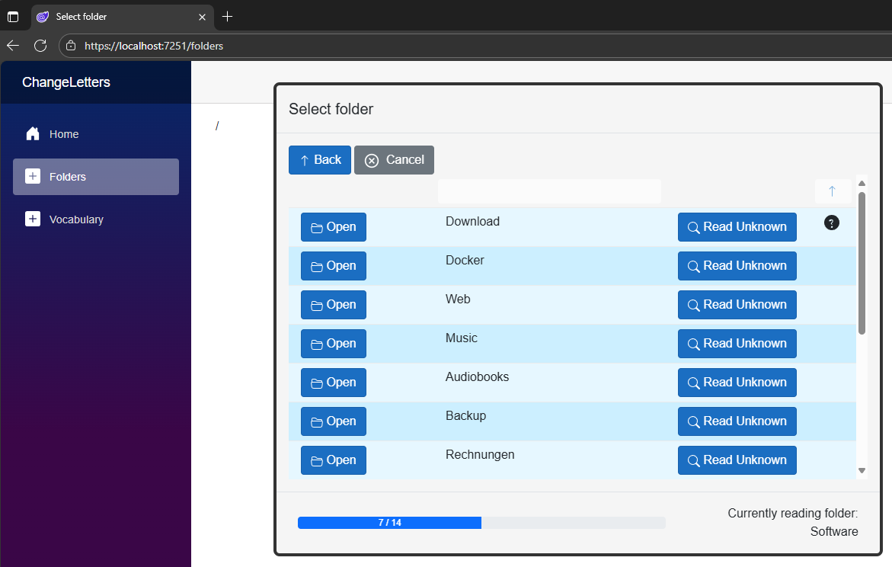

# ChangeLetters ✍️

ChangeLetters is a small playground project to experiment with different technologies while solving a real-world problem.  
The goal: apply **clean architecture** and **clean code** while keeping the solution extendable and maintainable.

---

## 🎯 Problem

- An application writing to a NAS only supports ASCII.  
- Unknown characters are replaced by `?`, making filenames unreadable in File Explorer.  
- The user cannot configure the charset/codepage in the application.  

---

## 🛠 Solution

ChangeLetters:  
- Uses a vocabulary database to map unknown characters back to valid ones.  
- Can integrate with **OpenAI** to make educated guesses if no mapping exists.  
- Provides a **web-based UI** to manage folders and vocabulary.  
- Demonstrates **clean architecture** and **TDD practices** in a backend project.  

---

## 📸 Screenshot

  
*Folder selection in the ChangeLetters web UI.*

---

## 🚀 How to run

1. Clone the repository  
   ```bash
   git clone https://github.com/RobertHaerle/ChangeLetters.git
   
2. Open the solution in Visual Studio / Rider

3. Build & run the application

4. Open the UI in your browser:
   https://localhost:7251
